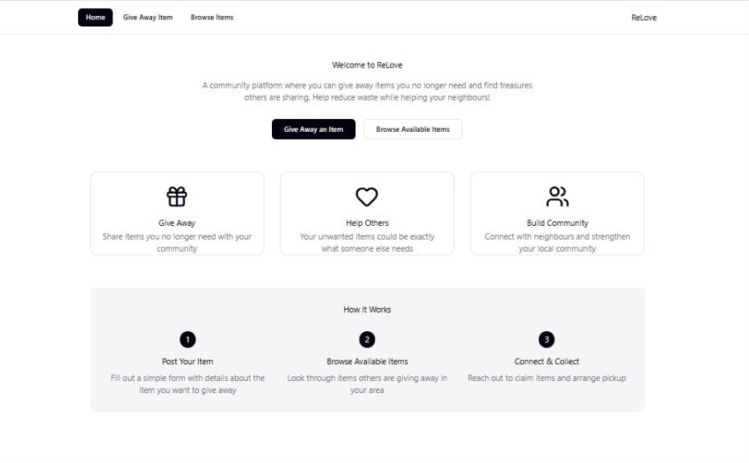
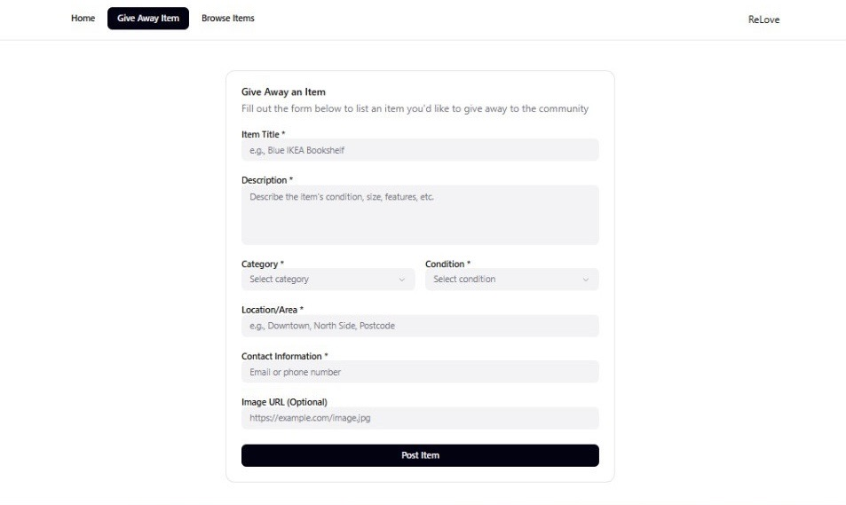
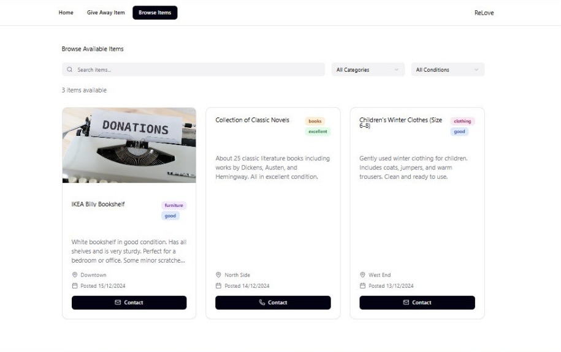

# ♻️ ReLove - Give love, Get love

**ReLove** is a full-stack web application that allows users to give away or browse preloved items in their community all while reducing waste and supporting a more sustainable future. Users can post items they no longer need and others can browse and contact the item owners via email or phone. It's a simple, community-driven platform designed to promote reuse and reduce waste and use preloved items in a trusted, local network..

---

## 🚀 Live Demo

🔗 [https://relovehomepage.onrender.com/)

---

## 🧠 Problem Domain

Millions of usable items are thrown away every year while others in the same community may be in need. PreLove bridges this gap by creating a space for people to easily give away items they no longer need, helping others and the planet.

---

## 🎯 Project Objectives

- Design and implement a full-stack web application
- Use HTML, CSS, and JavaScript for the front end
- Create a Node/Express back-end server
- Connect to a PostgreSQL database using Supabase
- Deploy a working application on Render
- Collaborate effectively as a team using Git and GitHub

---

## 🧍‍♀️🧍 User Stories

- As a **first-time visitor**, I want to easily and quickly understand how the platform works so I know how to use it.​
- As a **user**, I want to give away my items by filling out a form so I can help others.​
- As a **user**, I want to browse available items.​
- As a **user**, I want to filter items available by category/condition, so I can find what I need quicker.​
- As a **user**, I want to easily access the website on different devices, so I can use it both on mobile and desktop.​
- As a **user**, I want the website to be easily accessible so everyone can use it regardless of their needs.​
- As a **user**, I want to see an item as claimed, so that others know it’s no longer available.

---

## 🖼️ Wireframes & Design





---

## 🛠️ Tech Stack

**Frontend:**

- HTML
- CSS
- JavaScript (Vanilla)
- DOM Manipulation

**Backend:**

- Node.js
- Express.js

**Database:**

- PostgreSQL via Supabase

**Other Tools:**

- Git & GitHub (Version Control)
- Trello (Project Management)
- Render (Deployment)
- Figma (Wireframe)

---

## 🔍 Features

- 🧾 Post items to give away via a simple form
- 📦 Browse available preloved items
- 📞 Contact item owners via mail or phone
- ✅ Fully responsive design
- 📁 Connected to a live PostgreSQL database

---

## 🧱 Challenges We Faced

- Live collaboration with Git/GitHub ~ we had to resolve many code conflicts
- How file paths differed once deployed to Render
- Showing a stock image for each category ~ some of them a random picture from an array
- Confetti animation took a lot of research and tries to get right

---

## 📋 Guide

1. At the top-right, above the files, click on the green button saying "Code" to show the drop-down.

2. Choose the preferred link that you want to use to clone the project to your own machine.

3. On your machine's terminal, make a new folder which will house the project locally:

```console
git clone [COPIED LINK HERE]
```

4. Open your IDE, such as VSCode:

```console
code .
```

5. Take some time to look through the folders and familiarise yourself with where everything is. In your terminal, move to the client folder:

```console
cd client
```

6. Now install all dependencies needed:

```console
npm install
```

Now you can develop locally by running:

```console
npm run dev
```

---

## 📚 References & Resources

- [Javasript for active nav links](https://www.youtube.com/watch?v=bEOwXmd9Mc8)

- [Active Navlinks](https://stackoverflow.com/questions/72050328/add-active-class-to-navbar-element-when-clicked)

- [Form Shadow and style](https://codepen.io/haibnu/pen/DrVweV)
- [Box-Shadow](https://css-tricks.com/almanac/properties/b/box-shadow/)
- [Dummy Data](https://www.youtube.com/watch?v=NaDNgroJ7Cg)
- [Responsive Products](https://www.youtube.com/watch?v=F24tAMLoOEw)
- [Images in Javascript](https://developer.mozilla.org/en-US/docs/Web/API/HTMLImageElement/Image)
- [Images in Javascript](https://www.youtube.com/watch?v=HWHfzt1kp84)
- [Javascript Objects](https://www.w3schools.com/js/js_objects.asp)
- [HTML Form Standards](https://html.spec.whatwg.org/multipage/forms.html#categories)
